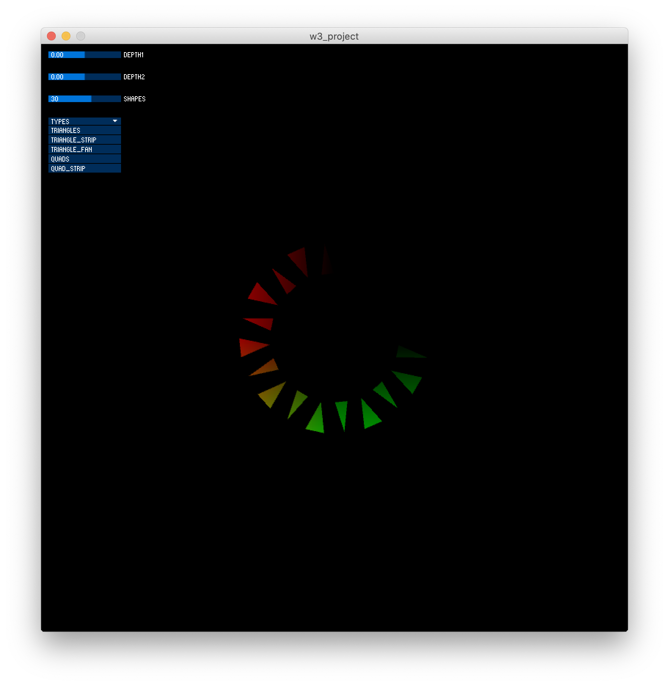
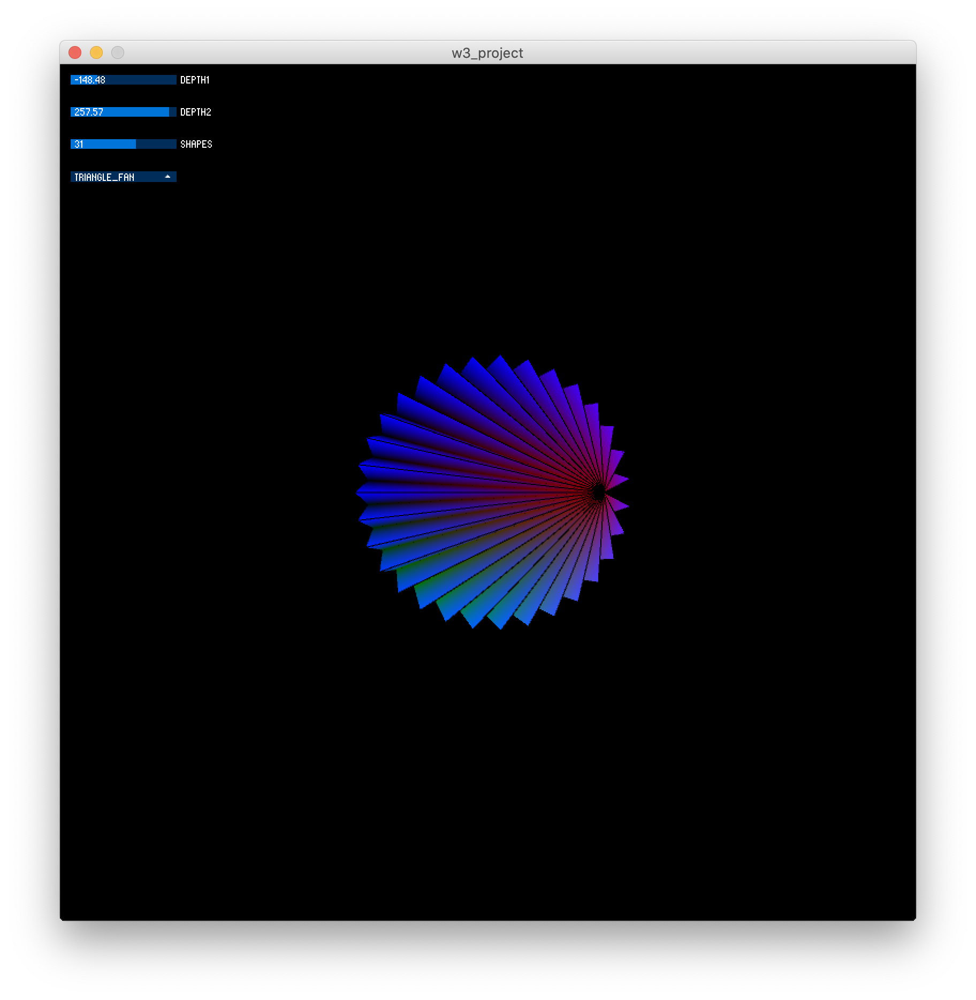
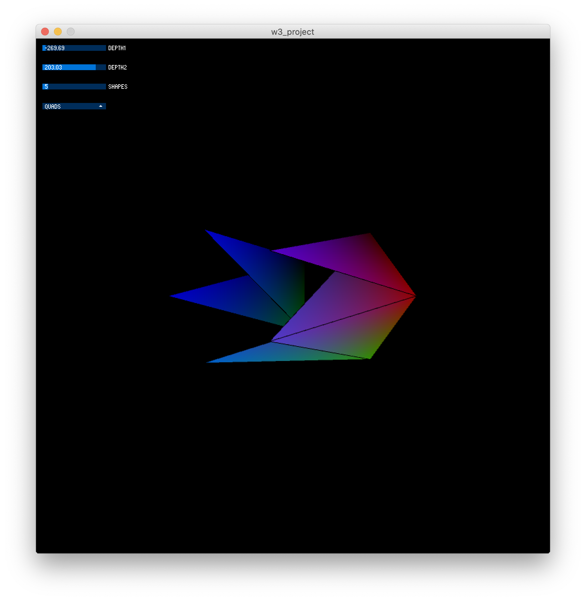

I wanted to do something with the vertex functions in processing because I felt I would have more flexibility than using the standard cube or sphere. After exploring some processing reference examples, I came across one example that caught my eye which was the https://www.processing.org/examples/trianglestrip.html. I really liked the effect this made in 2D and thought I could get an interesting design in 3d as well. I began by adding z coordinates and gave the user two different options of how far in negate to positive z direction they wanted go for the two vertices. I then added another slider so they can choose how many shapes will be drawn within the object. I then started experimenting with what shape to choose that would give an interesting output, but then realized this could also be an option that user wishes to choose. There is also color within the object, but I decided to not give the user control over this because I felt if they have too much control there would be much less of a surprise being displayed.

