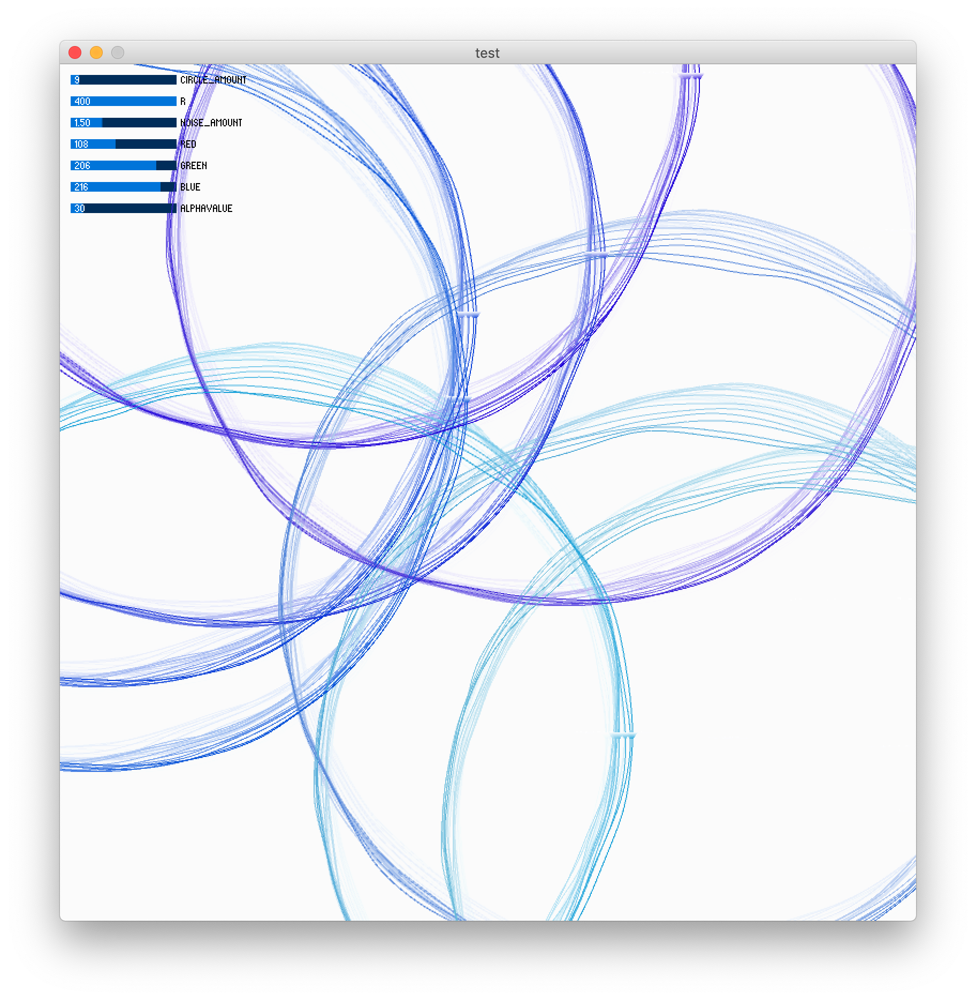
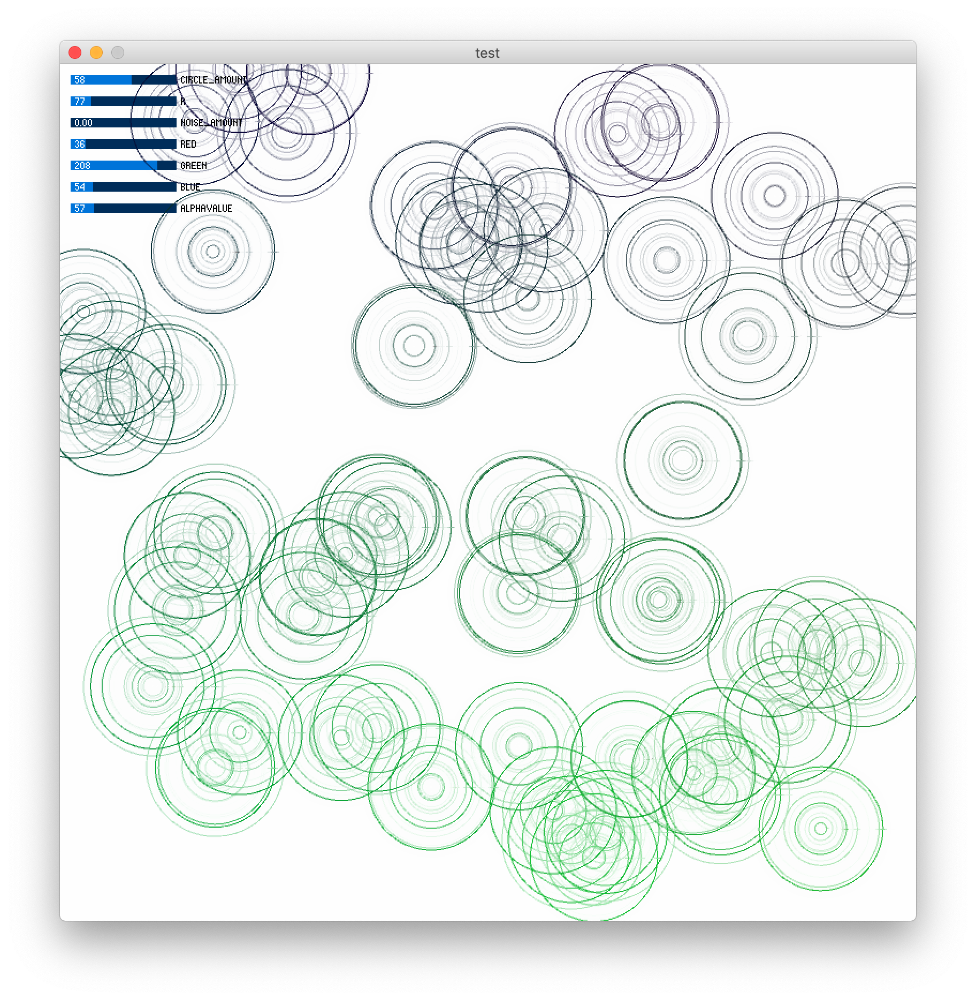
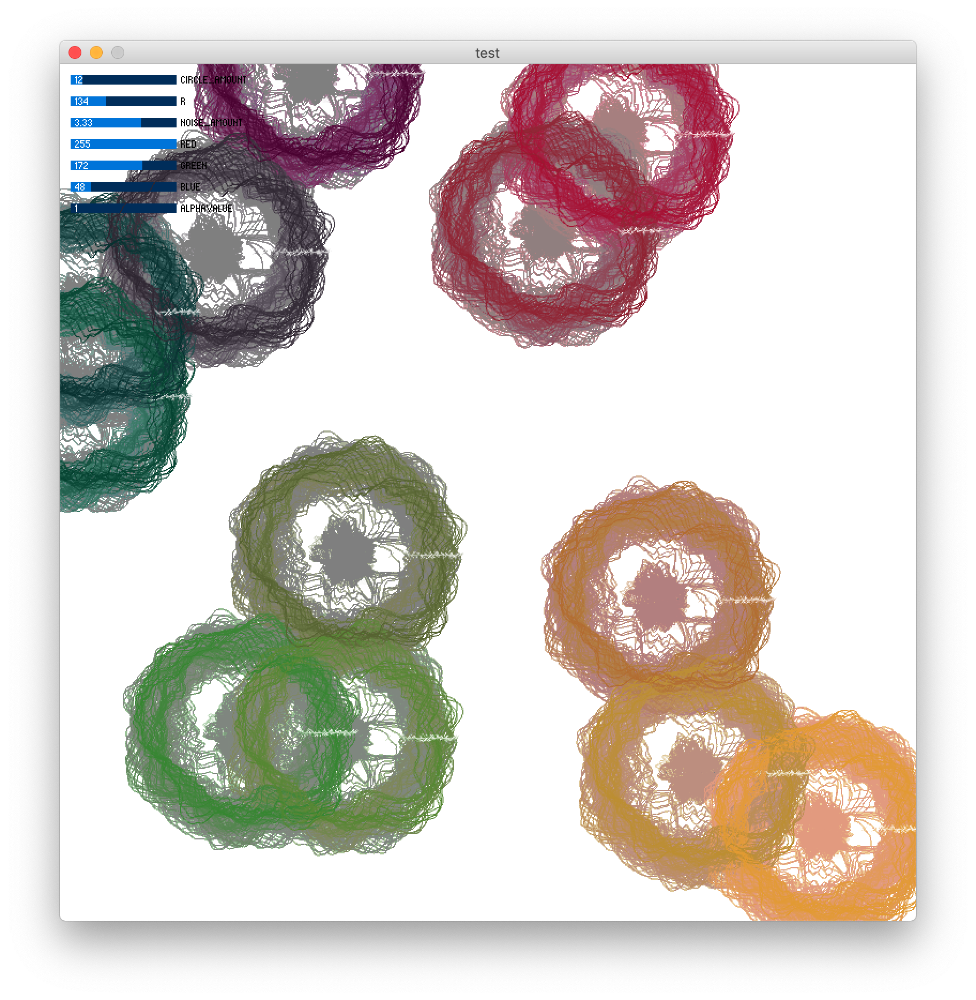

## Generative Design

I built this project using an example I have seen many times on [open processing](https://www.openprocessing.org/sketch/765930). This example show vertices being drawn and using perlin noise to offset the vertices to create this moving circle. I then thought it would be interesting to have many of these objects being drawn and let the user be able to adjust the noise levels and radius of each object. This already changes the figure a lot from just being a simple moving circle to now looking like a butterfly or critter moving or possibly sound vibrations. I then added color and also used the example from class to adjust the alpha value of the rectangle being overlayed. This allowed the color to either fill up the screen or quickly disappear with each drawing. The color is being mapped to the location of the object on the screen. Each object is also being randomly placed on the screen using the random function, so that every time this program is run the user will have a slightly different output. 

