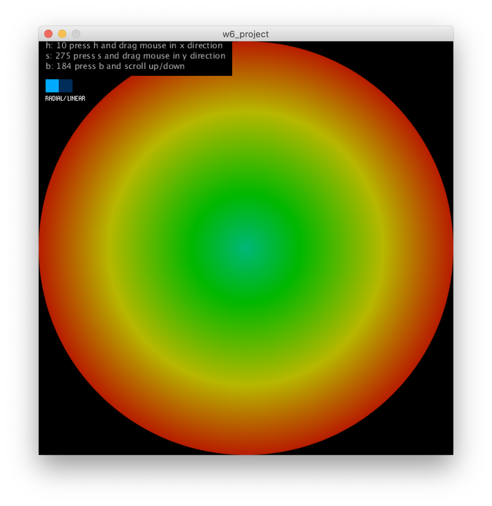
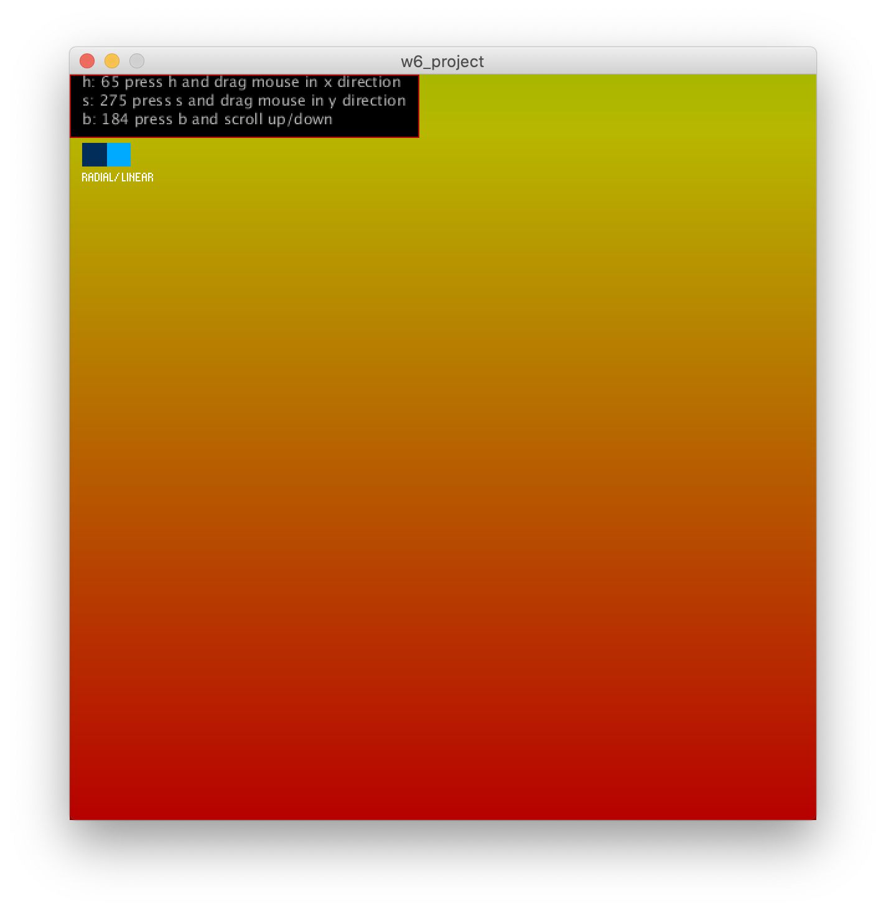
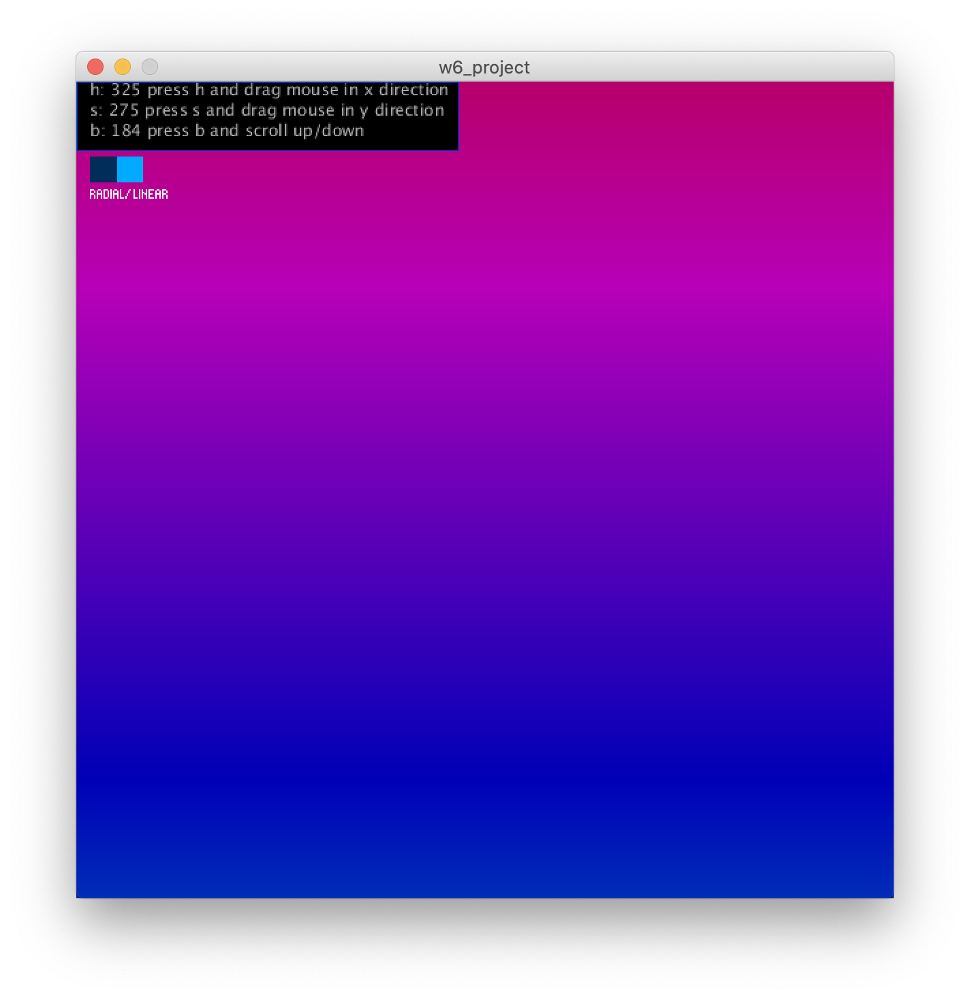

## Color Picker

I came up with this color picker sort of off the pattern drawing example in the Drawing Manager's library. This color picker has the user hold down either the "h", "s", or "b" key and then moving the cursor at a certain speed in a certain direction until the user lets go of that key. This allows the user to choose the color and either be gentle or aggressive with how they move there mouse. This reminded me of how Peder used Sonia's drawing manager tool and changed the way he interacted with the mouse depending on the sound playing. Also, my tool allows two different perspectives of seeing the color change in a linear gradient display or a radial gradient display, so that once the user picks a color they can also see possible colors that would be similar if trying to make a color pallete. 

